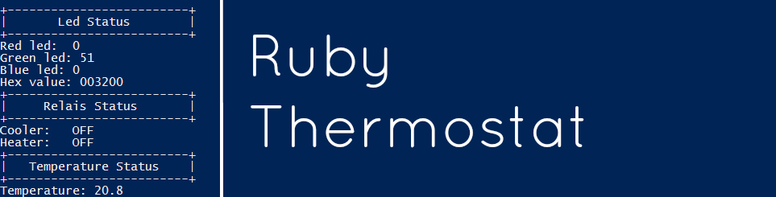

# Thermostat in Ruby:



## What does this do?

With this app you can visualize a thermostat system that turns a relay on or off depending on the temperature. It also shows the temperature in relation to the given target and range using a RGB led.

## Installing the app.

You will need ruby and get the gem via this command.
```
gem install thomas-ghysbrecht-thermostat-exercise
```

## How to use it.

The app requires 3 key values to be able to run. A target, range and temperature. It is already possible to pass on that last one via different ways. This is a print out of '-h'.

```
Usage: app.rb [options]
    -K, --Kelvin=TEMP                Temperature in Kelvin
    -C, --Celcius=TEMP               Temperature in Celcius
    -F, --Fahrenheit=TEMP            Temperature in Fahrenheit
    -t, --target=TEMP                Target temperature
    -r, --range=TEMP                 Range for temperature
    -H, --httpget=LINK               Get the temperature from the link
    -m, --mqtt=LINK                  Set the mqtt broker link
    -s, --subscribe=NAME             Subscribe to MQTT channel (broker link mandatory)
    -j, --json=FILENAME              Use a JSON file for the temperature
    -h, --help                       Prints this help
```  

***

#### Kelvin temperature:

The temperature can be passed on in Kelvin.

```
ruby app.rb -t 27.4 -r 1 -K 301
```
***

#### Celcius temperature:

The temperature can be passed on in Celcius.

```
ruby app.rb -t 27.4 -r 1 -C 23.9
```
***

#### Fahrenheit temperature:

The temperature can be passed on in Fahrenheit.


```
ruby app.rb -t 27.4 -r 1 -F 80.7
```
***

#### HTTP temperature:

The temperature can be passed on by providing a link where the app can get a temperature.


```
ruby app.rb -t 27.4 -r 1 -H "https://labict.be/software-engineering/temperature/api/temperature/fake"
```
***

#### MQTT temperature:

The temperature can be passed on via MQTT. A broker link and a topic to subscibe to must be given with the arguments.

```
ruby app.rb -t 27.4 -r 1 -m "mqtt.site.be" -s "topic/temperature"
```
***

#### JSON temperature:

The temperature can be passed on via a JSON file. This file must follow this format.

```json
{
"temperature" : "10.87"
}
```

```
ruby app.rb -t 27.4 -r 1 -j "test.json"
```
***

## License

Distributed under the [MIT](https://opensource.org/licenses/MIT) license.

## Contact

Thomas Ghysbrecht - [@snoopymonster](https://twitter.com/snoopymonster)

## Contributing

1. Fork it (<https://github.com/yourname/yourproject/fork>)
2. Create your feature branch (`git checkout -b feature/fooBar`)
3. Commit your changes (`git commit -am 'Add some fooBar'`)
4. Push to the branch (`git push origin feature/fooBar`)
5. Create a new Pull Request
